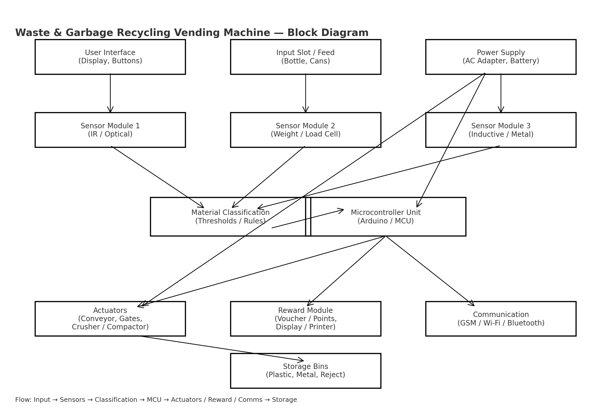

# Waste and Garbage Recycling Vending Machine  

This is my undergraduate final-year project at Ekiti State University, Ado-Ekiti.  
The project focuses on automating waste collection and incentivizing recycling using a vending machine model.  

## Block Diagram

## Features
- Accepts recyclable waste items (plastic bottles, cans, etc.)
- Detects material type using sensors
- Rewards users with points/vouchers
- Compact design for easy deployment

## Tools & Technologies
- **Hardware:** Microcontroller (Arduino/8051/PIC), Sensors, Motors  
- **Software:** C / Python (for simulation & control logic)  
- **Documentation:** PDF write-up included  

## Author
**Ayodele Damilola Isaac**  
Bachelor of Engineering, Computer Engineering (4.1/5.0 CGPA)
